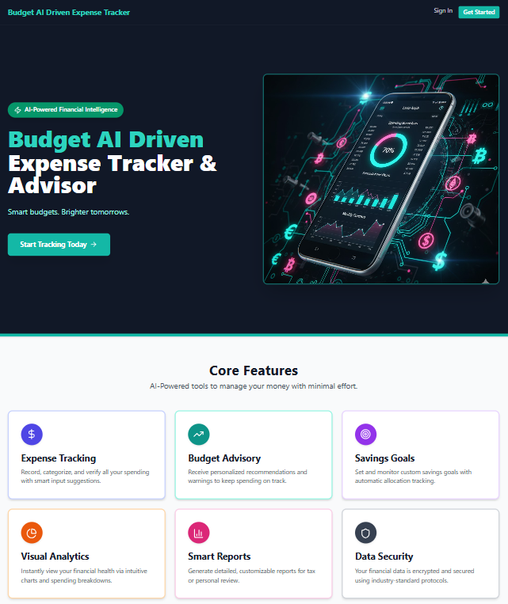
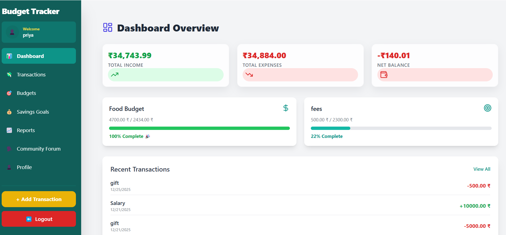
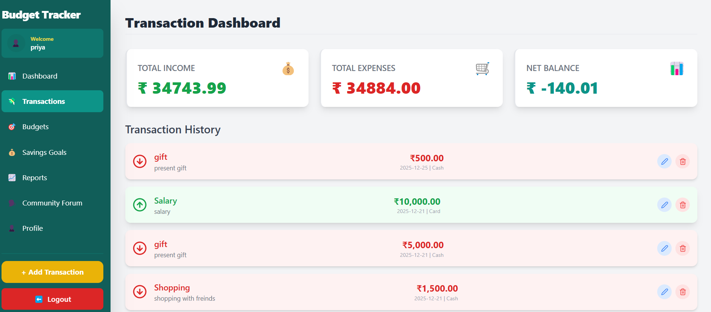
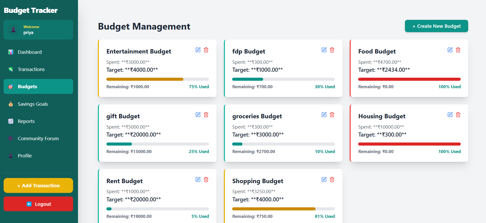
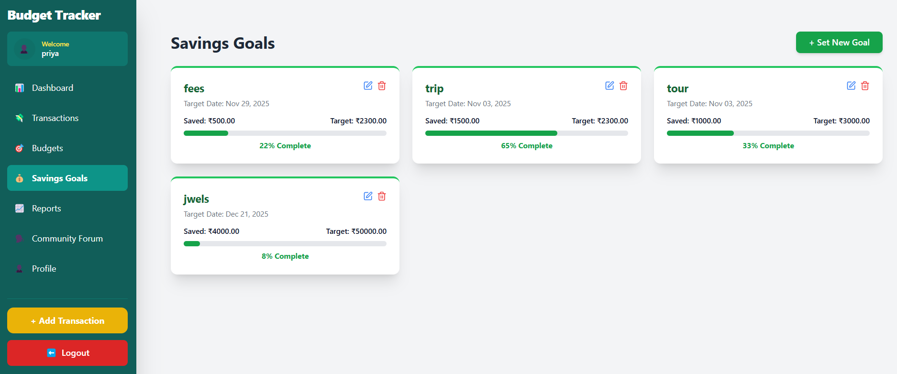
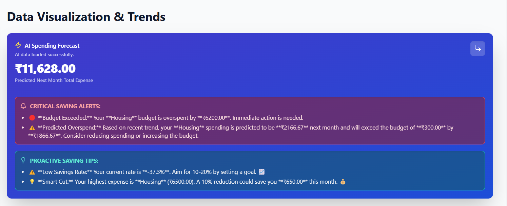
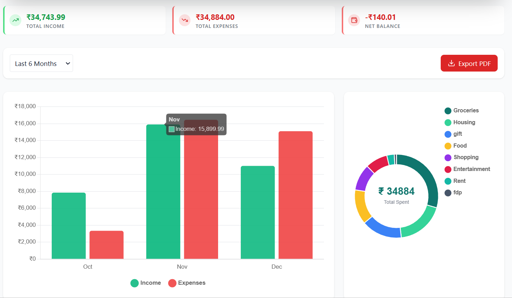
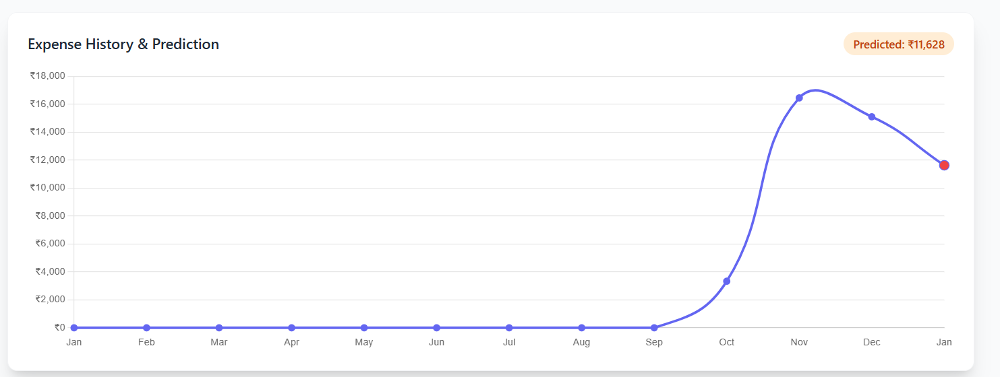
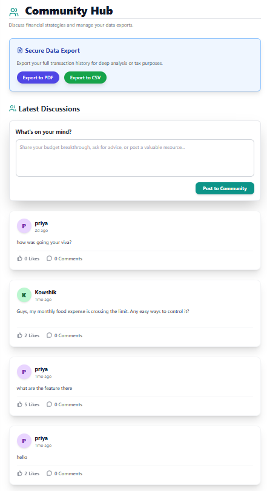
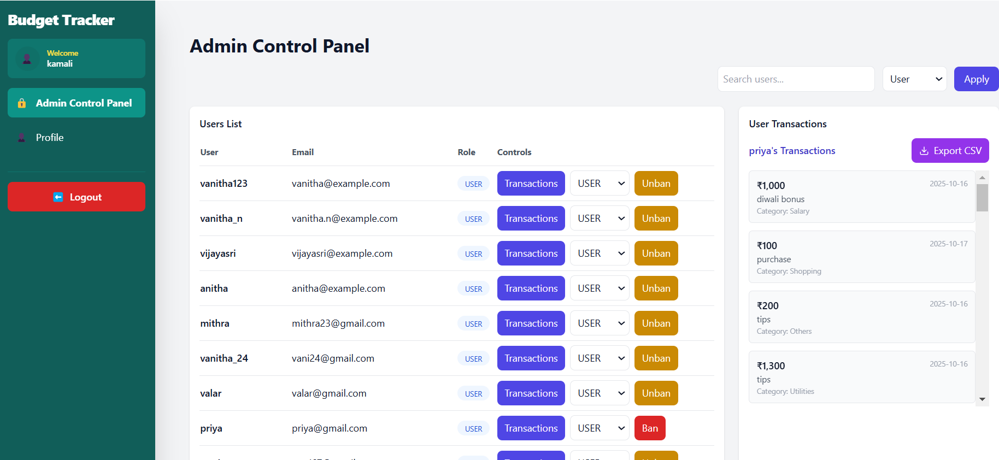

# 💰 Budget AI Driven Expense Tracker & Advisor

A smart and intuitive **AI-powered Expense Tracker and Budget Advisor** built with  
**React (Frontend)** and **Spring Boot (Backend)**.  
This project helps users analyze spending, plan budgets, set saving goals, and view future predictions using interactive charts and analytics.

🔗 **Live Preview (Screenshots Below)**  
📌 *Smart budgets. Brighter tomorrows.*

---

## ✨ Core Features

- 📊 **Dashboard Overview** – Track income, expenses & financial summary
- 🧾 **Transaction Manager** – Add, edit, delete personal financial records
- 🎯 **Budget Planning** – Create category-based budgets & usage tracking
- 💸 **Savings Goals** – Set financial targets and progress visualization
- 🤖 **AI Advisor** – Spending alerts, predictive insights, monthly forecast
- 📈 **Analytics & Charts** – Pie charts, line graphs, expense breakdowns
- 🔐 **User Authentication** – Role-based login for User & Admin
- 🛠️ **Admin Panel** – Manage users, export data (CSV/PDF)
- 📤 **Data Export** – Export transactions for tax & report usage

---

## 🛠️ Technologies Used

| Area | Technologies |
|------|--------------|
| Frontend | React, HTML, CSS, JavaScript |
| Backend | Spring Boot, REST API, Java |
| Database | MySQL |
| Charts & Analytics | Chart.js / Recharts |
| Security | JWT Authentication |
| Export | jsPDF, CSV Export |

---

## 📌 Project Structure
BudgetWise_ExpenseTracker(Infosys)
│── budgetWiseAI_frontend/ # React Frontend
│── budgettracker_backend/ # Spring Boot Backend
│── project-images/ # README screenshots
│── LICENSE # MIT License


---

## 🖼️ Preview Screenshots

### 🏠 Homepage / Landing


### 📊 Dashboard Overview


### 📌 Transactions Manager


### 🎯 Budgets Module


### 💰 Savings Goals Tracking


### 🤖 AI Insights, Alerts & Predictions




### 👥 Community Forum


### 🛡️ Admin Control Panel


---


📍 Frontend (React)
cd budgetWiseAI_frontend
npm install
npm start

### 📍 Backend (Spring Boot)

```sh
cd budgettracker_backend
mvn spring-boot:run
📑 License

This project is licensed under the MIT License.
✔️ Free to use | ✔️ Modify | ✔️ Distribute
📄 See LICENSE file for full details.
